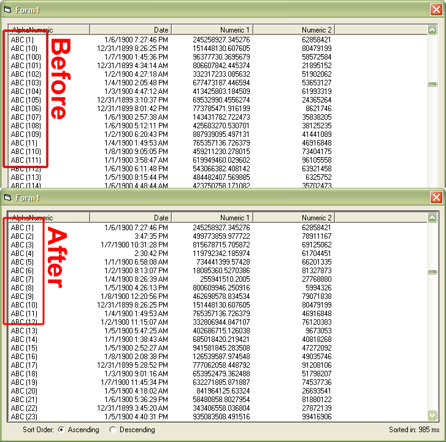



## Proper Listview Sorting

### Description

- 02/18/08 - updated to the final version of RDE's Pretty Sort (linked below) as well as to use the new StrCompFileNames function.

- 11/08/06 - updated to fix the issue Manuel noted dealing with the code not correctly sorting based on Column order.

- 10/25/06 - I completely rewrote the module after discovering several bugs in the Listview control - plus it is now more than twice as fast! This is as close to a drop-in solution as I can make it - with no known side effects.

The project uses Rde's Pretty File Names - Final 4 (http://www.pscode.com/vb/scripts/ShowCode.asp?txtCodeId=63893&amp;lngWId=1) and subclassing to properly sort alphanumeric columns in a listview.

Native sorting, and all other sorting techniques tried, will return:

Item (1)

Item (10)

Item (2)

...

Item (9)

But this module correctly sorts the list as:

Item (1)

Item (2)

...

Item (9)

Item (10)

The module also has examples on how to correctly sort numbers and dates. Sorry but it isn't documented - won't make bones about it, just don't have time but it is suprisingly short and fairly easy to read.

After days of searching, as far as I know this is the ONLY solution available to correctly sort a listview. Give it a try and please report any issues found.
 
### More Info
 

             |
---                |---
**Submitted On**   |2008-02-18 08:14:02
**By**             |[PlanetBoogie](https://github.com/Planet-Source-Code/PSCIndex/blob/master/ByAuthor/planetboogie.md)
**Level**          |Intermediate
**User Rating**    |4.9 (44 globes from 9 users)
**Compatibility**  |VB 5\.0, VB 6\.0
**Category**       |[VB function enhancement](https://github.com/Planet-Source-Code/PSCIndex/blob/master/ByCategory/vb-function-enhancement__1-25.md)
**World**          |[Visual Basic](https://github.com/Planet-Source-Code/PSCIndex/blob/master/ByWorld/visual-basic.md)
**Archive File**   |[Proper\_Lis2102272182008\.zip](https://github.com/Planet-Source-Code/planetboogie-proper-listview-sorting__1-66868/archive/master.zip)

